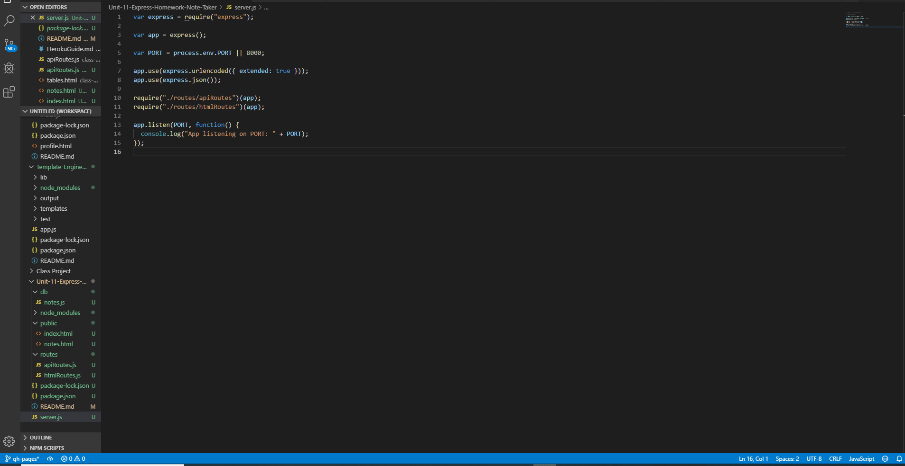

# Unit-11-Express-Homework-Note-Taker

## The user should have a text input that allows them to create and save notes.Express application that uses a json file to save a user's todo notes.

db/  notes.json           // contains json file that stores notes
public/   
index.html
notes.html      // front end

routes/         // API and HTML routes
  apiRoutes.js  
  htmlRoutes.js

server.js       // Runs the application

